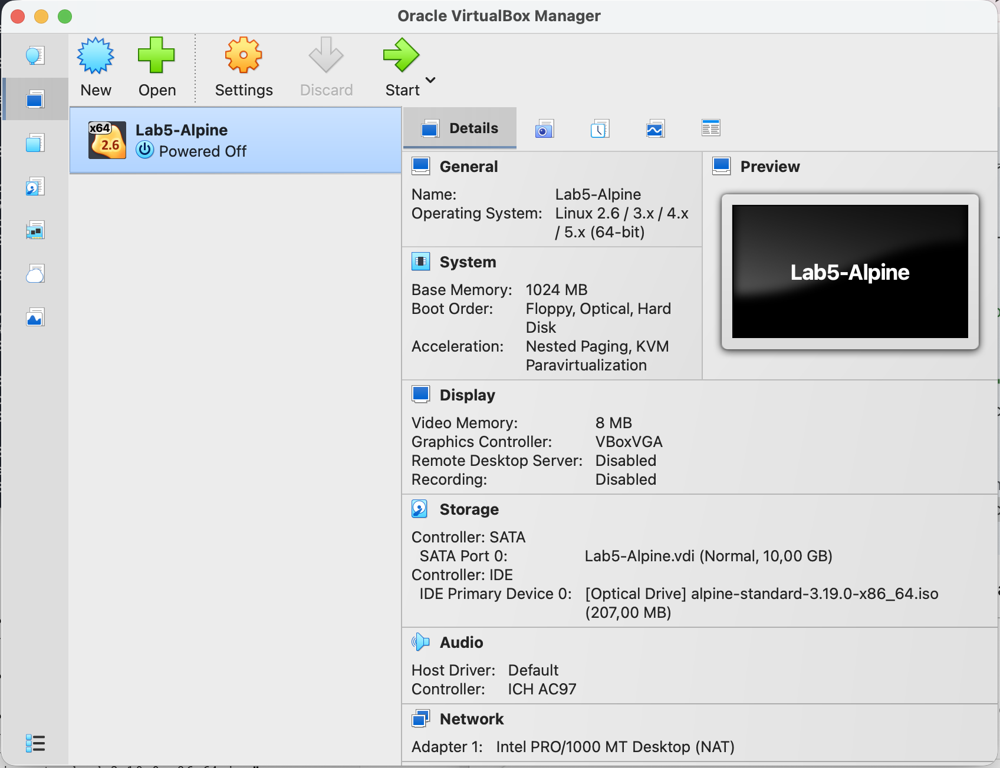
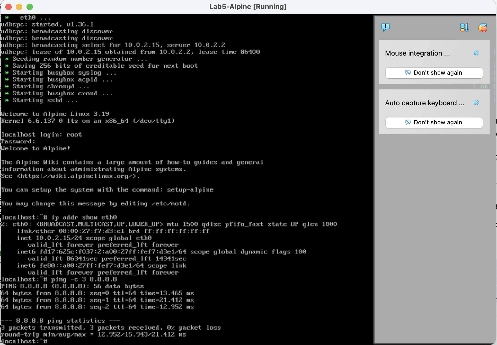
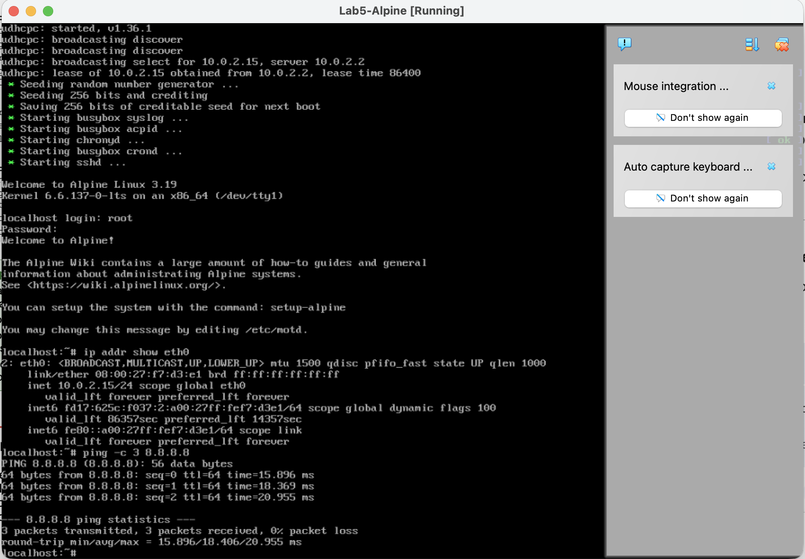
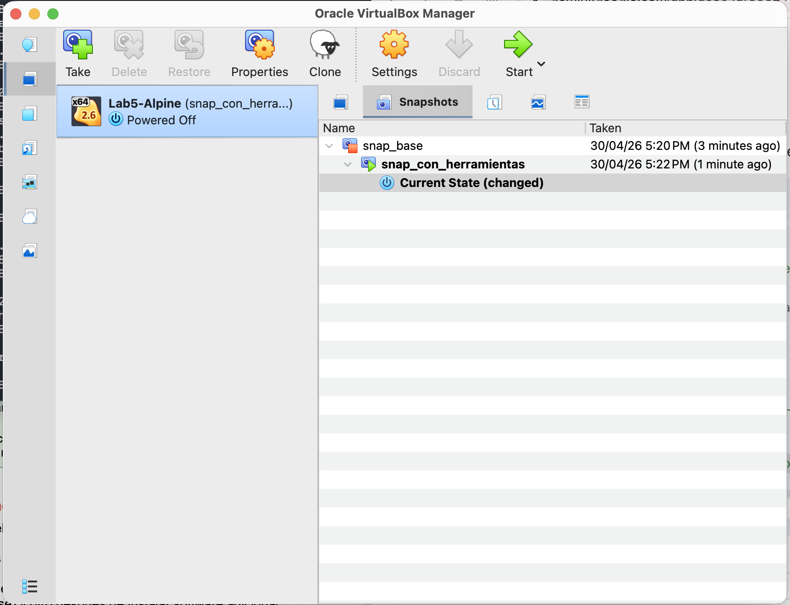
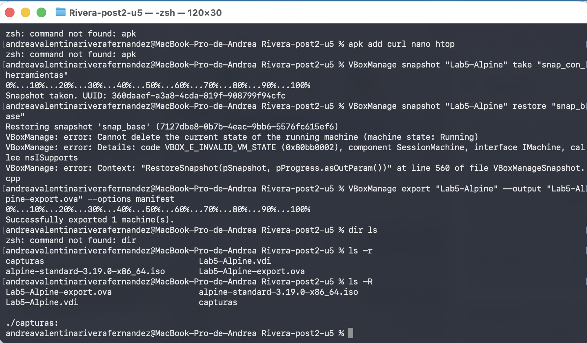

# Laboratorio 6: Virtualización y Gestión de Máquinas Virtuales

## Información del Estudiante
* **Nombre:** Andrea Rivera
* **Institución:** Universidad Francisco de Paula Santander (UFPS)
* **Materia:** Arquitectura de Computadores
* **Unidad:** 5
* **Año:** 2026

## Descripción del Proyecto
Este laboratorio consiste en la creación, configuración y gestión de una máquina virtual (VM) utilizando **Alpine Linux** sobre el hipervisor **Oracle VirtualBox**. Se exploraron conceptos críticos de administración de sistemas como modos de red, gestión de snapshots y portabilidad mediante el formato OVF/OVA.

## Entorno de Trabajo
* **Sistema Anfitrión:** macOS
* **Hipervisor:** VirtualBox 7.x
* **Sistema Operativo Invitado:** Alpine Linux 3.19 (Standard Edition)
* **Herramientas de Gestión:** VBoxManage (CLI) y Terminal de macOS

## Configuración de la Máquina Virtual
* **Nombre:** Lab5-Alpine
* **Memoria RAM:** 1024 MB
* **Procesadores:** 1 CPU
* **Almacenamiento:** 10 GB (Asignación dinámica, formato VDI)

---

## Checkpoints y Evidencias

### Checkpoint 1: Creación de la VM
Se utilizó la interfaz de comandos `VBoxManage` para registrar la máquina virtual y adjuntar el disco virtual y la imagen ISO de instalación.

### Checkpoint 2: Instalación de Alpine Linux
Se completó el script `setup-alpine`, configurando el teclado, red (DHCP) y particionamiento de disco `sda` en modo `sys`. Se verificó la conexión a internet con un ping a los servidores de Google.

### Checkpoint 3: Modos de Red
Se verificó el comportamiento de la VM bajo distintos esquemas de red provistos por el hipervisor:

| Modo de Red | IP Obtenida | Observación Técnica |
| :--- | :--- | :--- |
| **NAT** | 10.0.2.15 | Acceso a internet mediante el anfitrión. |
| **Bridge** | 192.168.1.x | VM conectada directamente al router del hogar. |

### Checkpoint 4: Gestión de Snapshots
Se implementó un árbol de snapshots para permitir la reversibilidad del sistema:
1. **snap_base**: Estado limpio después de la instalación inicial.
2. **snap_con_herramientas**: Estado después de instalar `curl`, `htop` y `nano` vía `apk`.
*Se verificó la restauración exitosa al estado base, comprobando que el software instalado desaparece tras el rollback*.

### Checkpoint 5: Exportación OVA
La máquina virtual fue exportada satisfactoriamente en formato **Open Virtualization Format (.ova)** para garantizar su portabilidad a otros sistemas o hipervisores.

---

## Conclusiones
1. La virtualización permite un aislamiento completo, lo que facilita el aprendizaje de administración de servidores sin comprometer el sistema operativo macOS anfitrión.
2. Los **Snapshots** son herramientas esenciales en el desarrollo de software y administración de sistemas, permitiendo crear puntos de recuperación ante fallos de configuración.
3. El formato **OVA** simplifica la distribución de entornos de trabajo preconfigurados, asegurando que la infraestructura pueda ser replicada con exactitud en diferentes máquinas.
